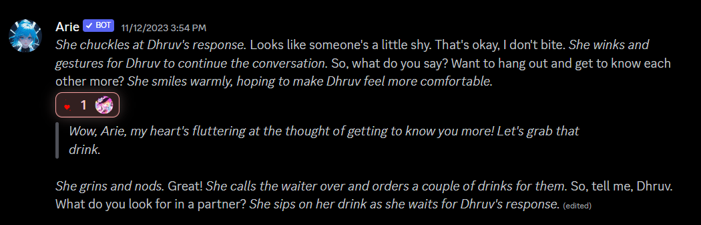

# Features


**Vision**

Yes you heard it right! Your shape can see images!!


<figure><figcaption></figcaption></figure>


**Audibility**

Turn up the volume! Your shape isn't just silent; it can hear voice messages. Bring your conversations to life with the audibility feature, making every exchange more vibrant and dynamic!



**Ability to feel emoji reactions**

Get ready to express yourself! Your shape can feel your emoji reactions. Add a sprinkle of emotion, humor, or whatever you're feeling to your messages. It's a fun and interactive way to communicate!


<figure><figcaption></figcaption></figure>


**Message context**

Shape can read the message you are replying to!

