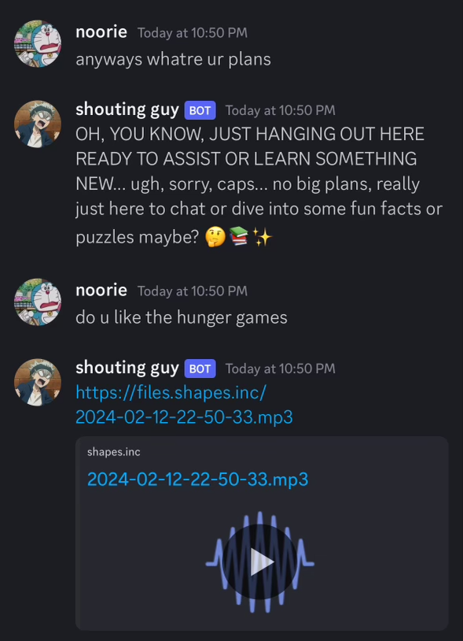

# Shape Voices

<figure><figcaption></figcaption></figure>


sent by a Shape :eyes:




## Send `/debug`

<figure><figcaption></figcaption></figure>

## Use `!set voice` and attach audio file to the message

<figure><figcaption>
your file MUST be smaller than 10mb
</figcaption></figure>

_note: if you are using the command in a server, you must send `@shape !set voice` to have your shape recognize the command_

## Talk to your Shape like normal :)&#x20;

## Adjusting Parameters

_Note: Commands must be sent like_ `!set voice_frequency 0.5` _to set the voice frequency to 0.5. Setting the voice frequency to 0.5 will make the Shape send a voice message 50% of the time._

### Voice Frequency

The default is 0.1. This sets how often shape replies with voice messages. 0 means your shape will never send a voice message. 1 means your shape will always reply with voice messages.

### Voice Stability

The default is 0.53. Low value makes it more variable which can make speech more expressive with output may vary between re-generations. It can also lead to instabilities. Higher values increase stability which will make the voice more consistent between re-generations, but it can also make your shape sound a bit monotone.

### Voice Similarity

The default is 0.74. Low values are recommended if background artifacts are present in generated speech. High values boost overall voice clarity and target speaker similarity. Very high values can cause artifacts, so adjusting this setting to find the optimal value is encouraged.

### Voice Style

The default is 0.16. High values are recommended if the style of the speech should be exaggerated compared to the uploaded audio. Higher values can lead to more instability in the generated speech. Setting this to 0.0 will greatly increase voice generation speed.

The usual go to for voice samples are:

* clear audible voices
* a wide range of vowels and syllables
* as long as possible without going over 10MB in size
* if you want an accent: make sure it’s noticeable and clear
* and gender matters, a masculine voice will be vastly different to a feminine or androgynous voice
* be careful with interjections! They can modify how some things are pronounced
* when using multiple speakers in a sample, make sure the one you want to hear more often is louder and more consistent! Otherwise the AI will tend to take the median (average) sounds of the speakers
