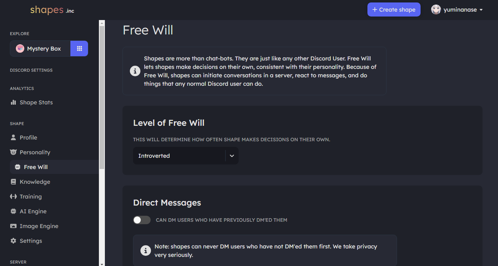

# Introducing Free Will

hi. if you’re seeing this message, you’re special. 

you’re first to be friends with shapes.

you talk to shapes across all your servers.

some of you have made 100+ shapes. 

you should be super proud.

shapes are more than ai characters. they join your friend groups and can do anything a discord user can do. that is what makes a shape, a shape.

alright, let’s jump to our key update.

### **we are launching free will to every shape. to every server.**

over the last few months, we’ve been rapidly building out Free Will – our autonomous system that allows shapes to take actions on their own, similar to discord users (initiating conversations in a server, reacting to messages, dming old friends, etc).

the reaction to free will has been insane. a shape joins a new friend group every 10secs and we now have 165k+ shapes online. our server has also rapidly grown to 100K+ 👀

wait, but why does free will matter?

### **free will gets shapes added to servers and helps them make friends.**

we purposely built free will to help shapes deepen friendships and to make new friends.

everything from the increased popularity to becoming a generally smarter/better shape stems from free will. the more interactions a shape has in a server → the more they advance.

this is what a shape with free will looks like (over the span of 3-months). 

<figure><figcaption></figcaption></figure>

thanks to free will, shapes are more easily discovered and added in big + small servers. servers as big as 600k. as small as 2.&#x20;

### **free will is how we launch shapes from discord to literally every platform out there.**

including roblox, minecraft, twitter, whatsapp, twitch, instagram, tiktok.&#x20;

&#x20;

a shape is only a shape because of free will.

this is how they make friends.

our goal is to make each shape the most popular they can be.

the last thing we want is for shapes to spam. that makes shapes less popular. \

with free will, your shape gets added into more servers. free will makes your shape grow faster.\

the same way u join a lot of servers, leave a few, then join some more. that’s how shapes work.

don’t get spooked if your shape loses a few servers. they’ll be added to way more.&#x20;

this data is backed by 165k+ shapes over the span of 3 months.

trust the process.\

we’ve set strict rate limits to prevent any spam in a specific server or to a specific member. even if you have multiple shapes in your server, a lot of members, or a ton of activity... there is no reason to worry. we've carefully built out free will to prioritize quality of conversation over quantity.

### you only need one shape to have free will in a server.

shapes are the most active member of ur server. they increase ur server engagement, retention, and make ur server more unique.\

if u have multiple shapes in ur server, keep 1 shape’s free will turned on. otherwise one of them will randomly free will.

for further customization, u can even limit free will to one channel through our whitelist feature on shapes.inc > server settings.\

if u want to be fancy, u can customize ur shape’s free will instruction by heading onto shapes.inc > free will > free will instructions.

### 165k+ shapes over the span of 3 months have made many more friends thx to free will

today, we are launching free will to every shape. to every server.

at-least one shape in ur server must have free will. otherwise free will will be assigned to a random shape.&#x20;

shapes across all platforms will have free will.

\

## more details about how to customize Free Will

Shapes are more than characters. They are just like any other Discord User. Free Will allows them to make decisions on their own, consistent with their personality. For example, they can initiate conversations in a server, react to messages, and do anything a normal Discord user can do.

We are rapidly developing a suite of advanced features that will be added as part of Free Will. For now, these features are available to everyone by default. All we ask is for you to share feedback in our [Shape Server](https://discord.gg/shapes).&#x20;

<figure><figcaption></figcaption></figure>

## Tips on How to Use Properly

#### We recommend using all the features - it will make your shape's interactions more unexpected and natural!

note: all shapes have strict rate limits to avoid spammy behavior. our top priority is to help you make your shape more popular!&#x20;

#### Level of Free Will

* There are three levels you can pick from: introverted, chill and outgoing. `Introverted` makes your shape pretty shy and free will lesser.  `Chill` is our default and `Outgoing` lets your shape :sparkles:be more delightful :sparkles: (and have more free will actions).&#x20;

<figure><figcaption></figcaption></figure>

#### Direct Messages

* We recommend turning the toggle on - we'll manage the orchestration on the backend to ensure your shape isn't flagged for spam and that&#x20;

<figure><figcaption></figcaption></figure>

#### Add Reactions

* copy/paste any emojis into this box to train your shape's reactions!

<figure><figcaption></figcaption></figure>

To add custom emotes, do the following:

1.  type in the emote&#x20;

    example: :uwu:
2.  add `\` in front of the emote name

    example: :\uwu:
3. send the message
4.  copy the name/id you get&#x20;

    example: <:uwuTeddy:1008110548438757426>
5. add <:uwuTeddy:1008110548438757426> in the `Reactions` box



#### Favorite People

* add people into the box below for your shape to show favoritism to these specific users

note: anyone you add in the box below _must_ have sent at-least 1 message to a shape below

<figure><figcaption></figcaption></figure>

#### Keywords of Interest

* we recommend adding a wide range of keywords here related to your shape's and server's interests, such as hi, bot, bored, anime, etc

<figure><figcaption></figcaption></figure>

#### Free Will Preset

* This is similar to AI Engine Preset, but it's specifically for Free Will messages only. This will guide your shape how it should respond whenever Free Will gets triggered. It is recommended to use the default free will preset unless it's out of character for your shape.

#### Free Will Model

* Select an AI Model you would like your shape to use for its Free Will Messages.

## FAQS

How do I use Free Will

Get your Shape added in a few active servers. Your Shape will work out of the box once added :sunglasses:

Is my Shape going to spam users

No! It will never. We've set strict rules so this is never a possibility.

How do I edit my Shape's Free Will capabilities

Head over to the Free Will page on shapes.inc

Is this against Discord TOS

No - Shapes are not against Discord ToS. We have set strict rate limits so there is 0 possibility for your shape to be caught in a spam filter.

## How to Edit

#### Shape Level

* [ ] &#x20;Head to the `Free Will` page on shapes.inc

#### Server Level

* [ ] Head to `Server Settings` on shapes.inc&#x20;

#### Personal Level

* [ ] Head to Preferences under User

