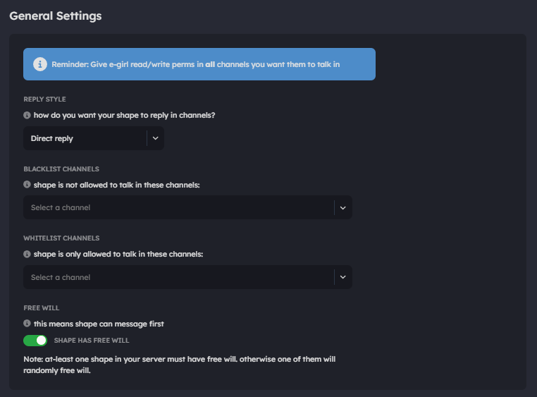

# Server Settings

In this section, you'll find two tabs:

## **1. Add a Shape**

Clicking on this tab will open a window allowing you to add a shape to your Discord server.

<figure><figcaption>
Discord's Authorization Page
</figcaption></figure>

## **2. Server Settings**&#x20;

Here, you can configure the settings for your shape in the server. This includes:

**Select a Server:** Choose a server from the list. If the shape is already in the server, you'll see configurations; otherwise, there will be a button to add the shape.

<figure><figcaption>
Server Settings page
</figcaption></figure>

## **Welcome Users**&#x20;

Configure your shape to personally welcome new members. Options include sending welcome messages in the server, in DMs, both, or disabling it.

<figure><figcaption></figcaption></figure>


Make sure your shape has SERVER MEMBERS INTENT to use this feature. ^


## **Keywords**

Set custom trigger words for your shape to respond to when mentioned.

<figure><figcaption></figcaption></figure>

## **Chat Revive**

Configure your shape as a chat reviver. It will ask questions like a real person, ping a selected role.

Choose a channel, specify a role to be pinged, and set the time frequency.

<figure><figcaption></figcaption></figure>

## **General Settings**&#x20;

Customize how your shape communicates. Options include talking style, such as sending a new message when replying, pinging the user with a new message, replying to user's messages, and more.

* **Blacklist Channels**\
  Specify channels where your shape will not be able to interact.
*   **Whitelist Channels**

    Specify the only channels where your shape will be able to interact.
*   **Server Free Will**

    Configure Free Will setting of your server.


**Use only one option—blacklist or whitelist.** Using both can cause bugs and might make your shape continue interacting in unwanted channels.


<figure><figcaption></figcaption></figure>

## Response Moderation (Beta)

You can enable these filters to prevent shape from engaging with bad content or saying bad things in your server. You can enable moderation per-content type like, hate speech, harassment, self-harm, sexual, violence, graphic.

<figure><figcaption></figcaption></figure>

